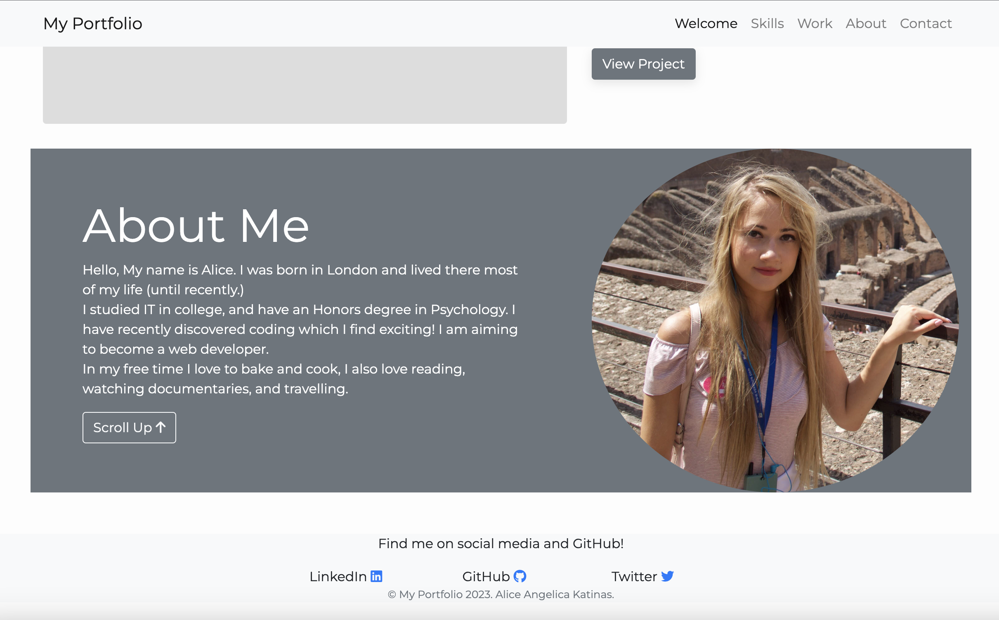

# Bootstrap-Portfolio

## Description

The aim of this project was to create a portfolio that was mostly made with Bootstrap. The portfolio would be used to display my projects and skills publicly, and allow me to update it with new projects in future.

## Usage

The portfolio's use is to display many of the projects that I have made all on one webpage. The portfolio will be continuously updated each time that I create a new project or amend a previous project, and the portfolio design itself can be modified too as I gradually improve my Bootstrap knowledge. It can be used to show my progress as I become more experienced with Web Development and enable me to track my growth as a developer throughout time. An additional benefit of a porfolio is that others can view my work, find out about me, and contact me.

Screenshots:

## License

My Bootstrap Portfolio is licensed under the MIT license.

## Installation

The link to my portfolio can be accessed below, the page is hosted by GitHub.

## Deployed webpage link
